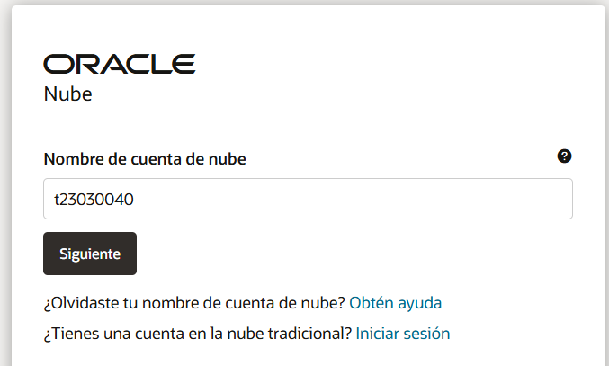
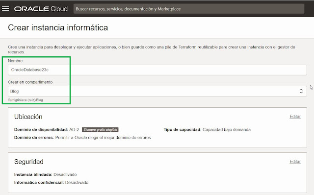
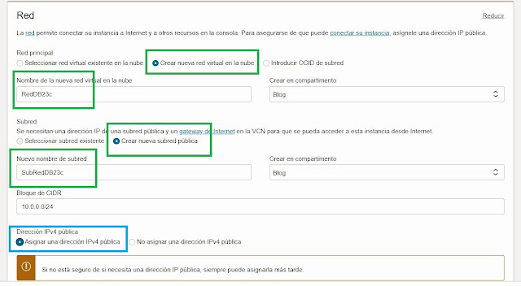

# 🌐 Oracle Cloud

----

## 🚀 Guía para Crear una Cuenta en Oracle Cloud y crear una instancia

---

## 📖 Creación de Cuenta en Oracle Cloud

1. Ve a [Oracle Cloud](https://www.oracle.com/cloud/).
2. Haz clic en **Empieza Gratis** ó  selecciona la opción de registro para estudiantes.
3. Completa el formulario de inscripción con tus datos personales.
4. Verifica tu correo electrónico y confirma tu cuenta.
5. Accede al **Panel de Oracle Cloud** para gestionar tus servicios.


## Creacion de una instancia en Oracle Cloud

1. Inicia sesión en Oracle Cloued con tu nombre de cliente en la nube proporcionado por Oracle.
 
 

 2. Coloca tus datos de inicio de sesión con los que iniciaste tu cuenta.

 


---
## 📂 1️⃣ Iniciar la Creación de la Instancia  
  
1. En el menú lateral, ve a **Compute** → **Rescursos informaticos**.  
2. Haz clic en **Instancia**.  


3. Haz clic en **Crear instancia**.


## ⚙️ 2️⃣ Configurar la Instancia  
- **Nombre de la Instancia**: Asigna un nombre (ejemplo: `mi-servidor`).  



- **Imagen del SO**: Selecciona una distribución (ejemplo: `Ubuntu 22.04`).  


- **Forma de la Máquina Virtual**:  
  - Para opciones gratuitas, selecciona **"Ampere A1 Compute"** o **"VM.Standard.E2.1.Micro"**.  
  - Para instancias más potentes, elige una configuración personalizada.  


- **Red**:  
  - Selecciona **"Crear nueva red virtual en la nube"** si no tienes una configurada.  
  - Habilita la asignación de **IP pública** si deseas acceso externo.  




## 🔑 3️⃣ Configurar Claves SSH  

En la siguiente sección, vamos a mantener la opción de generar el par de claves privada/pública y vamos a descargar ambas:


**Confirmando la creación**
En nuestro caso, no vamos a configurar ninguna de las opciones avanzadas, por lo que solo nos resta presionar el botón "Crear" para dar comienzo a la creación de la VM:


Automáticamente se dará comienzo al proceso de creación de la instancia, tal como vemos a continuación, y en algo menos de un minuto la misma estará disponible


En nuestro caso se necesitas acceso remoto por SSH, entonces colocamos el siguiente comando en nuestra termial de Power Shell:  
1. Genera una clave SSH en tu terminal con:  

   ```sh
   ssh-keygen -t rsa -b 4096 -f ~/.ssh/oracle_key

En nuestro caso esta seria una vista mas grafica para entender, apartit de aqui podemos hacer la configuracion que ocupemos para nuestra instancia, ya sea instalarle Apache y php para el uso y la creacion de lo que nos sea necesario.


-----
##### 💡 Autor: [Juan Pablo Gonzalez Gasca]
##### 📆 Última actualización: [28/Marzo/2025]
